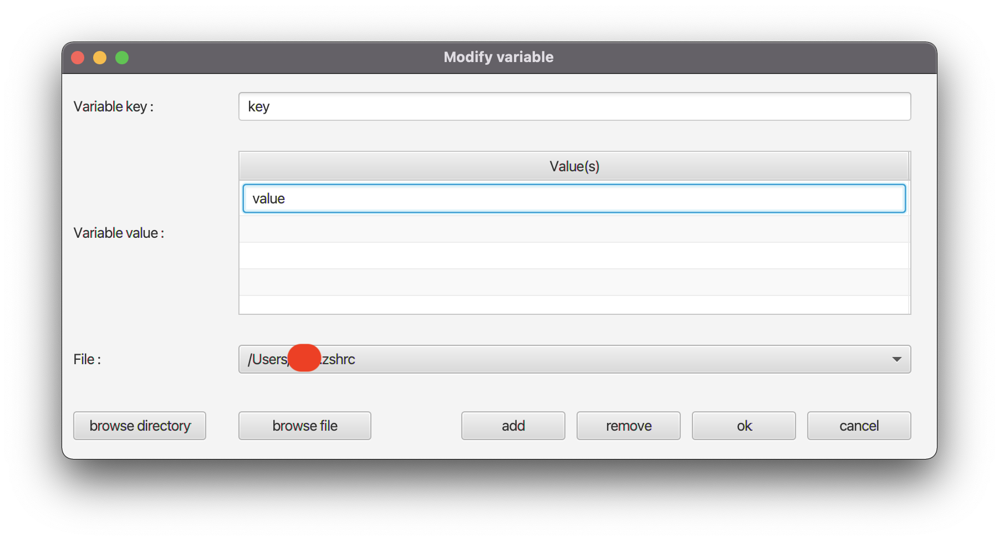

# Environment Variables Gui
Set environment variables with GUI

Application work on UNIX / Linux / macOS

Create application with this command `./gradlew jpackage`
build are in `build/jpackage`

[Need JDK 17](https://www.oracle.com/java/technologies/downloads/)

# Screenshot

